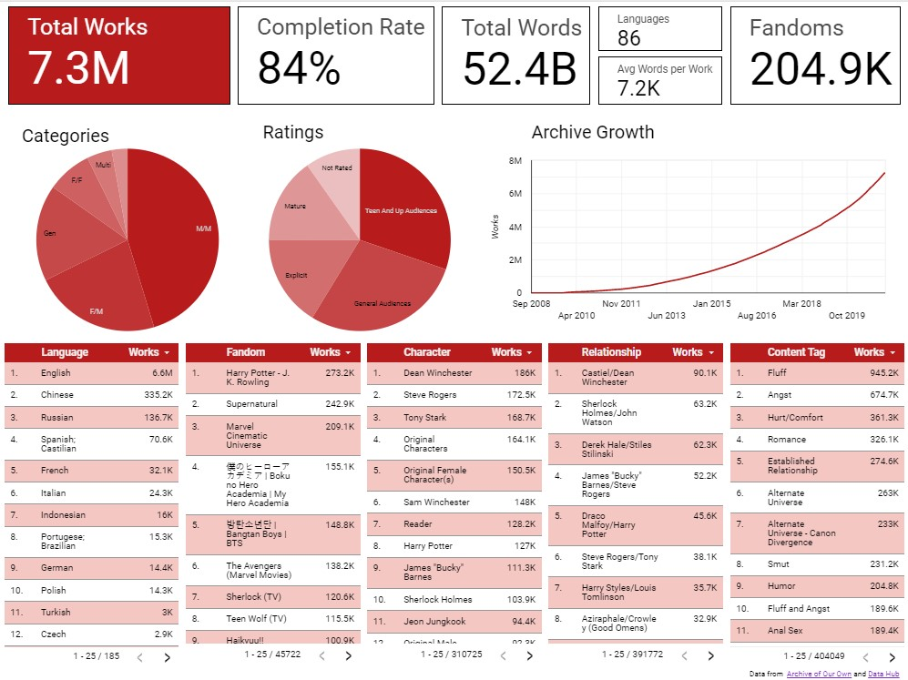

# Archive of Our Own 2021 Data Dump Explortory Data Analysis 
The Archive of Our Own (AO3) is a popular fanfiction archive with over 7 million fanworks, encompassing various fandoms, pairings, and genres. As a platform, AO3 offers a wealth of data that can be analyzed and mined to gain insights into various aspects of fandom culture and behavior.
This project aims to conduct an exploratory data analysis (EDA) on the AO3 dataset to uncover patterns and trends in fanfiction writing and consumption using BigQuery and Looker. The analysis will focus on the following research questions:
1. What are the most popular fandoms on AO3?
2. Which genres and pairings are the most popular?
3. How has the number of fanworks on AO3 grown over time?
4. How long are fanworks on average?
5. What percentage of fanworks on AO3 are completed?
6. What are the most popular languages used in fanworks on AO3? 

## 1. ETL 

The dataset used in this project was obtained from the Archive of Our Own (AO3) website. AO3 provided the dataset for analysis to the general public, which was then downloaded and uploaded to BigQuery for analysis. The dataset consists of two CSV files containing information on fanfiction works, including fandoms, genres, pairings, word count, date created, and date last updated. The files were uploaded to BigQuery using its user interface (UI) for further analysis.


## 2. Create a unique value for each entry

The initial dataset obtained from the Archive of Our Own (AO3) did not contain a unique identifier for each work. To avoid potential issues with data analysis, it was necessary to assign a unique value to each work. This was achieved using BigQuery's GENERATE_UUID() function, which assigns a random universally unique identifier.

The following SQL code was used to create a new column for the UUIDs, assign a unique ID to each row, and set the work_id as the primary key:


``` SQL
#Create column to add UUID to 
ALTER TABLE `ao3-2021-data-dump.ao3_dump_2021.works`
ADD COLUMN work_id STRING

#Assigns unique id to each row. Each row at this point represents one unique work
UPDATE `ao3-2021-data-dump.ao3_dump_2021.works`
SET work_id = GENERATE_UUID()
WHERE work_id IS NULL

#Makes work_id the primary key for the table 
ALTER TABLE `ao3-2021-data-dump.ao3_dump_2021.works`
ADD PRIMARY KEY (work_id)
NOT ENFORCED


```

With the unique ID assigned to each work, various analyses and queries can be performed without running into issues with duplicate or missing values. 


## 5. Summary Data

This SQL query calculates various statistics for the works in the AO3 dataset, including the total number of works, the average and maximum word count, the creation date of the oldest work, and the percentages of works that are restricted and completed. It uses the works table in the dataset as the source of the data.

Summary statistics can provide valuable insights and help answer important questions about a dataset such as:

* The total number of works can give an idea of the size and scope of the dataset, as well as the popularity of the platform or topic.
* The average and maximum word counts can provide information about the typical length and range of works in the dataset, which may be indicative of genre or audience preferences.
* The creation date of the oldest work can reveal how long the dataset has been active and can provide historical context for the content.

By analyzing summary statistics, it possible to gain a better understanding of the dataset as a whole, identify trends or patterns, and potentially make informed decisions about how to utilize or interact with the data.

``` SQL
SELECT
  COUNT(DISTINCT work_id) AS work_count,
  AVG(word_count) AS avg_word_count,
  MAX(word_count) AS max_word_count,
  MIN(creation_date) AS oldest_work, 
  ((
    SELECT
      COUNT(DISTINCT work_id)
    FROM
      `ao3-2021-data-dump.ao3_dump_2021.works`
    WHERE
      complete = TRUE)/COUNT(work_id))*100 AS percent_completed,
FROM
  `ao3-2021-data-dump.ao3_dump_2021.works`
 ```

## 5. Work Count Running Total 

This query calculates the running total of works created each day on the Archive of Our Own website.

It first uses a Common Table Expression (CTE) named works_created_by_day to count the number of works created on each day, grouping them by the creation_date.

Then, the code selects the creation_date and calculates the running total by summing up the work_count column using the SUM() function with an OVER() clause that orders the rows by creation_date. Finally, it groups the results by creation_date and work_count.


```SQL
WITH
  works_created_by_day AS (
  SELECT
    creation_date,
    COUNT(DISTINCT work_id) AS work_count
  FROM
    `ao3-2021-data-dump.ao3_dump_2021.works`
  GROUP BY
    creation_date
    )

  
SELECT
  creation_date,
  SUM(work_count) OVER (ORDER BY creation_date) AS running_total
FROM
  works_created_by_day
GROUP BY
  creation_date, work_count

```

## 6. Most Popular Tags

This query is used to generate a table showing the number of works associated with each tag on the Archive of Our Own website.

The query first creates a temporary table unnest_tag_id which splits the tag field in the works table into individual tag IDs and associates them with the corresponding work_id. The tag_id_split subquery uses the SPLIT() function to break up the tag field into an array of individual tag IDs. The unnest() function is then used to create a row for each tag ID associated with a work_id.

The second temporary table, tag_id_as_string, is used to join the tag IDs from the unnest_tag_id table with the tag names and types from the tags table. The CAST() function is used to convert the tag IDs to string format so that they can be joined with the tag_id_string field in the unnest_tag_id table.

Finally, the query selects the tag_id_string, tag_name, and a count of the number of distinct work_ids associated with each tag. The results are grouped by tag_id_string and tag_name and ordered by the count of works in descending order.

A statement in the WHERE clause could be added to filter the results by tag type, but for this project, the filter feature within Looker was used to filter the data for the dashboard.

``` SQL
WITH
  unnest_tag_id AS (
  WITH
    tag_id_split AS (
    SELECT
      work_id,
      SPLIT(tags, "+") AS tags_split
    FROM
      `ao3-2021-data-dump.ao3_dump_2021.works`)
  SELECT
    work_id,
    tag_id
  FROM
    tag_id_split,
    UNNEST(tags_split) AS tag_id),
  tag_id_as_string AS (
  SELECT
    name AS tag_name,
    type AS tag_type,
    CAST(id AS STRING) AS tag_id_string
  FROM
    `ao3-2021-data-dump.ao3_dump_2021.tags` )
SELECT
  tag_id_string,
  tag_name,
  COUNT(DISTINCT work_id) AS work_count
FROM
  unnest_tag_id
JOIN
  tag_id_as_string
ON
  tag_id_string = tag_id
GROUP BY
  tag_id_string,
  tag_name
ORDER BY
  work_count DESC
```

## 6. Most Common Languages 

To analyze the language distribution of works on AO3, a different approach was taken compared to querying the tags. The language information was actually stored within the works table, but it provided language codes instead of the actual language names. While the language codes do convey the necessary information, it can be challenging to interpret less common languages or for users who are not familiar with the two-character codes.

To address this, a dataset containing language codes and names was obtained from Data Hub. This dataset was uploaded as a table into BigQuery. By performing a join operation, specifically a right join, between the works table and the language table from Data Hub, it became possible to retrieve the actual names of the languages associated with the language codes in the works table. The right join ensured that any language codes not included in the Data Hub dataset would still be preserved in the results.

The SQL code then selects the language name and applies the count aggregation function to calculate the number of distinct work IDs for each language. The results are grouped by the language code and language name, ensuring that the counts are aggregated per language. Finally, the results are ordered in descending order based on the number of works, providing insights into the most common languages used on AO3.

```SQL 
SELECT
  language_name,
  COUNT(DISTINCT work_id) AS works
FROM `ao3-2021-data-dump.ao3_dump_2021.works`
RIGHT JOIN `ao3-2021-data-dump.ao3_dump_2021.language`
  ON `code` = `language`
GROUP BY `language`, language_name
ORDER BY works desc


```


## 7. [Creating the Dashboard](https://lookerstudio.google.com/reporting/a85d3850-afa0-4614-b8b5-93bb71d3730b)



The final step in the project involved creating a dashboard using Looker to visualize and explore the data. The data was imported into Looker using the SQL queries that were previously written.

To start, tables were created in Looker for the most common tags of different types: fandom, relationship, character, and content. Since the SQL queries returned the most common tags without filtering by type, Looker's filtering capability was utilized to filter the data by tag type. Initially, the plan was to display the top 10 most common tags for each type, but it was later decided to provide users with the option to explore further. The interactive nature of the dashboard allows users to scroll or page through the data as they dive deeper into the tag details. 

Similar to the tag tables, a language table was also created using relevant data to provide insights into the distribution of languages on AO3.

The dashboard layout was designed with a focus on addressing the original questions. Scorecards were positioned at the top, providing concise and relevant information that quickly answers the questions. Below the scorecards, an archive growth graph was included to showcase the exponential growth of the archive over time. 

Following these elements, the previously created tables were placed to present detailed information on the most common tags. However, for the category and rating tag types, pie graphs were used instead of tables. This decision was based on the nature of these tag types, which have a small and finite number of potential values. In contrast, the other tag types (fandoms, relationships, content, and characters) have a large number of potential values, with new tags being generated as more fanworks are added to the archive.

Overall, the Looker dashboard provides an interactive and visually appealing way to explore the data, enabling users to gain insights into the most common tags, archive growth, and the distribution of different tag types.
